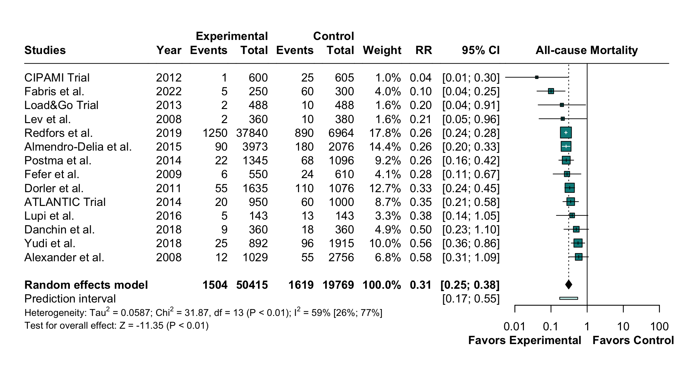

<a href="https://gewehrdm.github.io" style="
    display: inline-block;
    padding: 10px 15px;
    margin: 20px 0;
    background-color: #1D3557; /* Azul escuro */
    color: white; /* Texto branco */
    text-decoration: none;
    border-radius: 5px;
    font-size: 16px;
    font-weight: bold;
    transition: background-color 0.3s ease, transform 0.2s ease;
    text-align: center;
"
    onmouseover="this.style.backgroundColor='#457B9D'; this.style.transform='scale(1.05)';"
    onmouseout="this.style.backgroundColor='#1D3557'; this.style.transform='scale(1)';"
    onmousedown="this.style.transform='scale(0.95)';"
    onmouseup="this.style.transform='scale(1.05)';"> ⬅ Back to Menu </a>

------------------------------------------------------------------------

### Difference Between Fixed-Effects and Random-Effects Models in Meta-Analysis?

------------------------------------------------------------------------

First, we need to understand the differences between fixed-effects and random-effects models. Both are methods used to combine the results of individual studies into an overall summary estimate!

-   **Fixed-effects Model** assume that all of the studies included in the analysis share a common true effect size, and any observed differences in effect size between studies are due to chance or random error. In other words, fixed-effects models assume that the true effect size is the same for all studies and that any observed differences in effect size between studies are just due to random variation.

-   **Random-effects Model**, on the other hand, allow for the possibility that the true effect size may vary from study to study, and that the observed differences in effect size between studies are due to both random error and true variation in the effect size (between-study heterogeneity). Random-effects models assume that each study has its own true effect size, and that the observed effect sizes across studies are drawn from a larger distribution of true effect sizes.

------------------------------------------------------------------------

#### Sources of Error

------------------------------------------------------------------------

-   The extent to which true effect sizes vary within a meta-analysis is called ***Between-Study Heterogeneity***.

-   The natural variation in a sample of data (sampling error \| random error \| random variation), from one study to another, which is beyond our control, is called ***Sampling Error***.

------------------------------------------------------------------------

#### Summary

------------------------------------------------------------------------

-   **Fixed-effects model** assumes that: Observed effect size = True effect size + ***SAMPLING ERROR***

    \*\*The idea behind the fixed-effect model is that observed effect sizes may vary from study to study, but this is only because of the sampling error. In reality, their true effect sizes are all the same: they are fixed.

-   **Random-effects model** assumes that: Observed effect size = True effect size + ***SAMPLING ERROR*** + ***BETWEEN-STUDY HETEROGENEITY***

------------------------------------------------------------------------

### Which Method to Choose?

------------------------------------------------------------------------

-   In health science meta-analyses, it is generally acknowledged that some degree of between-study heterogeneity can be expected. Therefore, it is conventional to use a random-effects model, which can account for this variability.

-   A fixed-effect model, on the other hand, may only be appropriate when there is no detectable between-study heterogeneity, or when there are very good reasons to assume that the true effect is fixed.

------------------------------------------------------------------------

### Types of Heterogeneity?

------------------------------------------------------------------------

Before we start discussing heterogeneity measures, we should first clarify that heterogeneity can mean different things.

1.  **Baseline (or *designed-related*) heterogeneity:**

    This type of heterogeneity occurs when the populations, interventions, comparators, or outcomes differ across the included studies. Such variability stems from differences in how studies are conducted, their settings, or the characteristics of the participants.

    [For instance:]{.underline}

    -   A meta-analysis including studies on various age groups, disease severities, or clinical settings might exhibit baseline heterogeneity.

    -   Differences in methodologies, such as trial follow-up, dosages, or measurement tools, can also contribute.

    -   Addressing baseline heterogeneity starts with a well-defined research question and a priori inclusion criteria, often guided by the PICOT framework. By clearly defining the population, intervention, comparator, and outcomes at the outset, researchers can minimize variability introduced by baseline differences.

2.  **Statistical Heterogeneity:**

    Statistical heterogeneity quantifies the variability in effect size estimates across studies included in the meta-analysis. It reflects how much the observed effects differ from what would be expected under a single fixed effect size.

    -   Baseline heterogeneity may lead to statistical heterogeneity when differences in populations or study designs result in varying treatment effects across studies.

    -   Baseline heterogeneity does not always translate to statistical heterogeneity.Baseline heterogeneity does not always translate to statistical heterogeneity - Studies with different designs may still produce consistent effect sizes, leading to low statistical heterogeneity.

    -   Statistical heterogeneity can exist even without baseline heterogeneity - For example, a meta-analysis of very similar studies may show high variability in effect sizes due to random sampling error or small sample sizes.

------------------------------------------------------------------------

### Measures of Heterogeneity?

------------------------------------------------------------------------

These three measures are related to heterogeneity in meta-analysis, but they serve different purposes. Here’s an easy way to understand them:

------------------------------------------------------------------------

1.  [**Q ( Chi^2^ )** – “Is There Heterogeneity?”]{.underline}

    -   **What it does:** Tests if there is more variability in the study results than expected by chance.

    -   **Practical use:** Answers the question, “Is heterogeneity present?”

    -   **How to interpret:**

        -   [Low Q (Chi^2^) and non-sgnificant (p \> 0.10):]{.underline} suggests that the variability is likely due to chance.

        -   [High Q (Chi^2^) and significant (p ≤ 0.10):]{.underline} suggests that the variability is likely due to chance.

2.  [**Tau^2^** – “How Much Heterogeneity?”]{.underline}

    -   **What it does:** Measures the absolute amount of variance in the true effect sizes across studies.

    -   **Practical use:** Quantifies how much the effect sizes differ between studies.

    -   **How to interpret:**

        -   **Tau^2^ = 0:** No variability between studies (all studies estimate the same effect size).Greater variability in the true effects.

        -   **Larger Tau^2^:** Greater variability in the true effects.

3.  [***I^2^*** - “What Percentage of the Variability is Due to Heterogeneity?”]{.underline}

    -   **What it does:** Indicates the proportion of total variability in the effect sizes that is due to heterogeneity (not chance).

    -   **Practical use:** Helps understand how much of the variability is caused by true differences between studies versus random sampling error.

    -   **How to interpret:**

        -   ***I***^**2**^ **= 0:** No heterogeneity (all variability is due to chance).

        -   ***I***^**2**^ **≤ 25:** Low heterogeneity.

        -   ***I***^**2**^ **\> 26-50:** moderate heterogeneity.

        -   ***I***^**2**^ **≥ 50:** substantial heterogeneity.

4.  [**Prediction Interval (PI) - "**What could future studies observe?"]{.underline}

    -   **What it does:** Provides a range where the true effect of a future study is expected to fall. Accounts for both within-study sampling error and between-study variability. Complements Tau^2^ and I^2^ , which describe variability but do not predict future outcomes. Prediction intervals (PIs) provide the expected range of true effects in future studies, accounting for both within-study error and between-study variability ( Tau^2^ ). Unlike confidence intervals (CIs), which estimate the precision of the pooled effect, PIs reflect the variability in potential real-world applications.

    -   **Practical use:** Adds clinical relevance by showing how results might vary in new settings. The prediction interval reflects the variation in true treatment effects over different settings, including what effect is to be expected in future patients, such as the patients that a clinician is interested to treat. Therefore, it should be routinely reported in addition to the summary effect and its CI, and used as a main tool for interpreting evidence, to enable more informed clinical decision-making.

    -   **How to interpret:**

        -   [Narrow PI:]{.underline} Suggests consistent effects across studies = Meta-analyses based on many studies and with low estimated heterogeneity.

        -   [Wide PI:]{.underline} Indicates high uncertainty or substantial heterogeneity = meta-analyses with few studies and substantial heterogeneity.

        -   [PI Including the Opposite Effect:]{.underline}

            -   A PI that spans the null effect (e.g., OR = 1.0) suggests uncertainty about the treatment’s effectiveness.

            -   If the PI contains the exact opposite effect (e.g., pooled OR = 2.0, PI includes OR = 0.5), it indicates substantial heterogeneity, making the pooled estimate less reliable.

        -   [Meta-Analyses with *I^2^* = 0:]{.underline} A substantial part of meta-analyses have an estimated of I^2^ 0. However, there is typically very large uncertainty about the exact amount of heterogeneity, and this is demonstrated by very large 95% CIs for the values of I^2^. So, when I^2^ = 0 , rely on the prediction interval to assess variability and generalization across studies.

------------------------------------------------------------------------

#### Summary

------------------------------------------------------------------------

+-------------------------+------------------------------------------------------+-----------------------------------------------------------+----------------------------------------------------------------+
| Measure                 | **What it does**                                     | Question It Answers                                       | Interpretation                                                 |
+=========================+======================================================+===========================================================+================================================================+
| **Q ( Chi^2^ )**        | Tests if heterogeneity is present.                   | “Is there heterogeneity?”                                 | Significant Q = heterogeneity exists.                          |
+-------------------------+------------------------------------------------------+-----------------------------------------------------------+----------------------------------------------------------------+
| **Tau^2^**              | Quantifies the absolute heterogeneity.               | “How much heterogeneity is there?”                        | Larger Tau^2^ = more between-study variability.                |
|                         |                                                      |                                                           |                                                                |
|                         | [*Absolute measure of heterogeneity*]{.underline}    |                                                           |                                                                |
+-------------------------+------------------------------------------------------+-----------------------------------------------------------+----------------------------------------------------------------+
| ***I^2^***              | Proportion of variability due to heterogeneity.      | “What percentage of variability is due to heterogeneity?” | Higher I^2^ = more heterogeneity.                              |
|                         |                                                      |                                                           |                                                                |
|                         | [*Relative measure of heterogeneity*]{.underline}    |                                                           |                                                                |
+-------------------------+------------------------------------------------------+-----------------------------------------------------------+----------------------------------------------------------------+
| **Prediction Interval** | Provides a range for true effects in future studies. | What could future studies observe?                        | Wide PI = Greater uncertainty; Narrow PI = Consistent effects. |
+-------------------------+------------------------------------------------------+-----------------------------------------------------------+----------------------------------------------------------------+

In sum, it is advisable to not resort to one measure only when characterizing the heterogeneity of a meta-analysis. It is recommended to at least always report 𝐼^2^ (with confidence intervals), as well as prediction intervals, and interpret the results accordingly.

------------------------------------------------------------------------

### How to report the heterogeneity assessment in the methods section?

------------------------------------------------------------------------

*"We assessed heterogeneity with Cochrane’s Q statistic, Higgins and Thompson’s I^2^ statistic, and prediction intervals (PI).^1-3^ We determined the consistency of the studies based on I^2^ values of 0%, ≤ 25%, ≤ 50%, and \> 50%, indicating no observed, low, moderate, and substantial heterogeneity, respectively.^1^ To judge the extent of heterogeneity, 95% PI for each component effect were estimated. The PI helps in the clinical interpretation of heterogeneity by estimating what true treatment effects can be expected in future settings.^2,3^ We restricted calculation of a 95% PI to meta‐analyses with four or more studies (≥ 200 participants), since the interval would be imprecise when a summary estimate is based on only a few small studies.^2,3^"*

------------------------------------------------------------------------

#### Example 1

------------------------------------------------------------------------

##### Interpreting the results

------------------------------------------------------------------------

***First, Is there heterogeneity?*** - We see that Q (Chi^2^), the Test of heterogeneity, is 49.46 This is a lot more than what we would expect based on the number of studies −1 = 13 degrees of freedom (df) in this analysis. Consequentially, the heterogeneity test is significant (p = 0.01).

***Second, How much heterogeneity is there?*** - We see that Tau^2^ = 0.11, indicating that some between-study heterogeneity exists in our data.

***Third, What percentage of variability is due to heterogeneity? (not chance)*** - We see that the I^2^ = 74% (95% CI 55% - 85%) using Higgins and Thompson’s “rule of thumb”, we can characterize this amount of heterogeneity as substantial.

**Fourth, What could future studies observe?** - The PI is 0.33–1.58, which spans both below and above the null hypothesis (1.0). This interval suggests that while the overall pooled effect size indicates benefit (e.g., an RR less than 1), future studies could observe results ranging from a substantial benefit (RR = 0.33) to potential harm (RR = 1.58).

------------------------------------------------------------------------

##### Here is how we could report the amount of heterogeneity we found in our example 1

------------------------------------------------------------------------

*"Experimental group was associated with lower rates of all-cause mortality (RR 0.73; 95% CI 0.57 - 0.93; p = 0.01; I^2^ = 74%) compared with control group. The 95% PI ranged from 0.33 to 1.58 indicating that negative intervention effects cannot be ruled out for future studies."*

------------------------------------------------------------------------

#### Example 2

------------------------------------------------------------------------

##### Interpreting the results

------------------------------------------------------------------------

***First, Is there heterogeneity?*** - We see that Q (Chi^2^), the Test of heterogeneity, is 31.87. This is a lot more than what we would expect based on the number of studies −1 = 13 degrees of freedom (df) in this analysis. Consequentially, the heterogeneity test is significant (p \< 0.01).

***Second, How much heterogeneity is there?*** - We see that Tau^2^ = 0.0587, indicating that some between-study heterogeneity exists in our data.

***Third, What percentage of variability is due to heterogeneity? (not chance)*** - We see that the I^2^ = 59% (95% CI 26% - 77%) using Higgins and Thompson’s “rule of thumb”, we can characterize this amount of heterogeneity as substantial.

**Fourth, What could future studies observe?** - The PI is 0.17–0.55. This narrow range does not cross the null hypothesis (RR = 1.0), indicating that future studies are likely to observe consistent beneficial effects of the intervention. The results suggest robust evidence for treatment efficacy, with little variability in outcomes expected in different settings.

------------------------------------------------------------------------

##### Here is how we could report the amount of heterogeneity we found in our example 2

------------------------------------------------------------------------

*"The experimental group was associated with lower rates of cardiovascular events compared to the control group (RR: 0.31; 95% CI: 0.25–0.38; p \< 0.01 ; I^2^ = 59% ). The 95% PI ranged from 0.17 to 0.55, suggesting that future studies are expected to observe consistent beneficial effects".*

------------------------------------------------------------------------

### References

------------------------------------------------------------------------

1.  Higgins JPT, Thompson SG. Quantifying heterogeneity in a meta-analysis. Statistics in Medicine. 2002;21(11):1539-1558.

2.  IntHout J, Ioannidis JPA, Rovers MM, et al. Plea for routinely presenting prediction intervals in meta-analysis. BMJ Open;2016;**6:**e010247.

3.  Riley RD, Higgins JPT, Deeks JJ. Interpretation of random effects meta-analyses. BMJ. 2011;342:d549.

4.  Higgins JPT, Thomas J, Chandler J, Cumpston M, Li T, Page MJ, Welch VA (editors). Cochrane Handbook for Systematic Reviews of Interventions version 6.5 (updated August 2024). Cochrane, 2024. Available from [www.training.cochrane.org/handbook](www.training.cochrane.org/handbook).

<a href="https://gewehrdm.github.io" style="
    display: inline-block;
    padding: 10px 15px;
    margin: 20px 0;
    background-color: #1D3557; /* Azul escuro */
    color: white; /* Texto branco */
    text-decoration: none;
    border-radius: 5px;
    font-size: 16px;
    font-weight: bold;
    transition: background-color 0.3s ease, transform 0.2s ease;
    text-align: center;
"
    onmouseover="this.style.backgroundColor='#457B9D'; this.style.transform='scale(1.05)';"
    onmouseout="this.style.backgroundColor='#1D3557'; this.style.transform='scale(1)';"
    onmousedown="this.style.transform='scale(0.95)';"
    onmouseup="this.style.transform='scale(1.05)';"> ⬅ Back to Menu </a>
