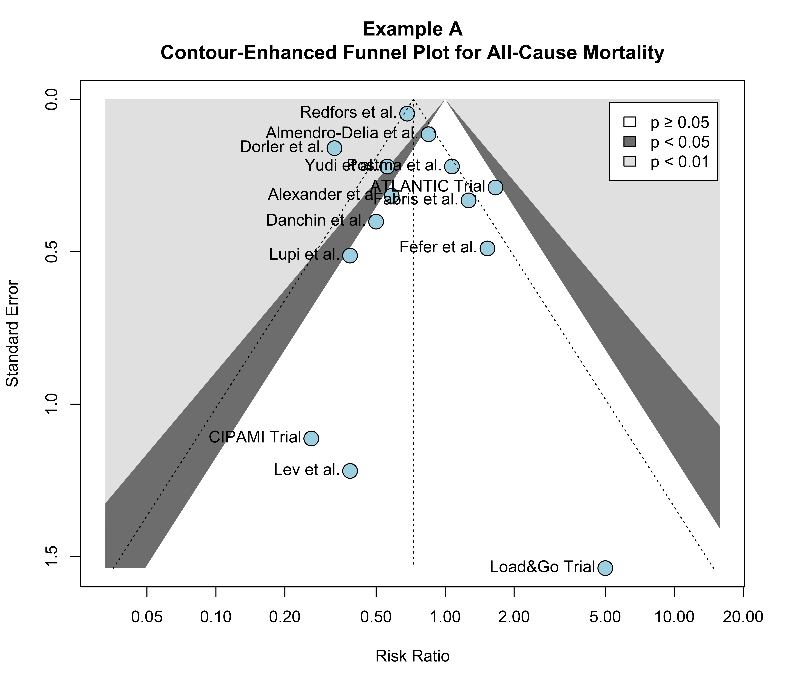
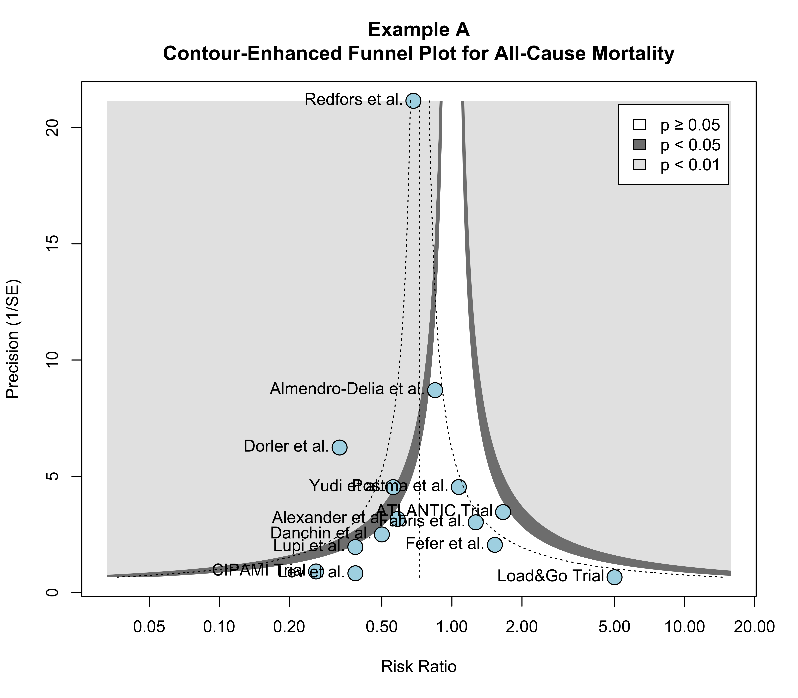

<a href="https://gewehrdm.github.io" style="
    display: inline-block;
    padding: 10px 15px;
    margin: 20px 0;
    background-color: #1D3557; /* Azul escuro */
    color: white; /* Texto branco */
    text-decoration: none;
    border-radius: 5px;
    font-size: 16px;
    font-weight: bold;
    transition: background-color 0.3s ease, transform 0.2s ease;
    text-align: center;
"
    onmouseover="this.style.backgroundColor='#457B9D'; this.style.transform='scale(1.05)';"
    onmouseout="this.style.backgroundColor='#1D3557'; this.style.transform='scale(1)';"
    onmousedown="this.style.transform='scale(0.95)';"
    onmouseup="this.style.transform='scale(1.05)';"> ⬅ Back to Menu </a>

### What is Publication Bias?

-   Publication bias occurs when the likelihood of a study being published depends on its results. Evidence suggests that studies with statistically significant or hypothesis-confirming results are more likely to be published.
-   When conducting a systematic search, we are limited to publicly available evidence, such as peer-reviewed articles, preprints, or other accessible reports. Publication bias implies not only missing studies but specifically those with unfavorable or non-significant findings.
-   Meta-analysis aims to provide an unbiased estimate of the average effect size in a population. However, if the sample is skewed due to publication bias, even statistically “true” estimates may not reflect the actual reality. It’s similar to estimating the size of an iceberg by measuring only its visible tip—leaving the larger, hidden portion unaccounted for.

### Addressing Publication Bias in Meta-Analyses

In meta-analyses, we can apply techniques to partially mitigate the risk of distortions caused by publication and reporting bias. Some of these strategies focus on improving the [study search process]{.underline}, while others involve [statistical adjustments]{.underline}.

1.  **Study Search** - Several specific approaches can help minimize the risk of bias:

    -   **Include Grey Literature:** such as dissertations, preprints, government reports, and conference proceedings;

    -   **Backward and Forward Snowballing:** Review the references of included studies (backward snowballing) and identify papers that have cited those studies (forward snowballing).

    -   **Search in Multiple Databases**

    -   **Comprehensive Search Strategies**

    -   **Contacting Study Authors for Unpublished Data**

2.  **Statistical methods:** Statistical methods can help detect signs of publication bias by analyzing patterns in the data, such as asymmetry in funnel plots or a correlation between study size and effect size. While these methods cannot directly confirm publication bias, they highlight its possible presence. Some techniques also adjust for potential bias, providing corrected estimates of the overall effect size to improve the reliability of the meta-analysis

------------------------------------------------------------------------

### The Small-Study Effects Concept

1.  **Large Studies:** Because they require significant resources, large studies are almost always published, regardless of their results.
2.  **Moderate-Sized Studies:** These are at some risk of not being published, especially if their results are non-significant. However, moderate statistical power often allows significant findings, increasing their chances of publication.
3.  **Small Studies:** These are most vulnerable to publication bias. Only small studies showing very large (and often exaggerated) effects tend to be published, while those with non-significant results remain unpublished (“file drawer problem”).

**The reasoning is straightforward:** Publication bias exists because **SIGNIFICANT RESULTS** are more likely to be published. Since **LARGER** studies have a **HIGHER** probability of producing significant results due to their larger sample sizes, publication bias disproportionately affects **SMALL STUDIES**, leading to an overrepresentation of large effect sizes in the published literature.

***Studies with small sample sizes ➞ Low precision (high standard errors) ➞ Wider confidence intervals ➞ Greater likelihood of non-significant results.***

This is precisely why methods for assessing publication bias focus on the issue of small-study effects. As the name suggests, these approaches are particularly concerned with the unique challenges posed by small studies.

------------------------------------------------------------------------

### Methods for Assessing Publication Bias - Small-Study Effects Methods

------------------------------------------------------------------------

#### Summary

1.  **Funnel Plot and Contour-Enhanced Funnel Plot** - **QUALITATIVE** way to inspect asymmetry.
2.  **Regression Tests** - **QUANTITATIVE** way to assess asymmetry.

------------------------------------------------------------------------

#### Funnel Plot

It is common practice to assess small-study effects using funnel plots. A funnel plot is a scatter plot that displays:

1.  [**X-axis:**]{.underline} the ***observed effect** sizes of studies*;
2.  [**Y-axis:**]{.underline} the ***standard error*** or ***precision (1/se)*** of the observed effect sizes of studies. Typically, the y-axis is inverted in funnel plots, so higher positions on the plot correspond to lower standard errors, indicating more precise estimates.
3.  [**The vertical line in the middle of the funnel:**]{.underline} represents the pooled effect estimate (either in random-effects or fixed-effects models).
4.  The plot also includes the idealized funnel shape that represents the expected distribution of studies in the absence of bias.

Take a look at the example below:


In the absence of small-study effects (no publication bias), the studies should approximately follow the idealized funnel shape displayed in the plot. Is this true in our example? Subjectively, we can say that the studies do follow the shape reasonably well.

-   Studies located in the top part of the plot have low SE and should lie closely together, and not far away from the pooled effect size.

-   Studies located in the lower part of the plot, with increasing SE, the funnel “opens up”, and effect sizes are expected to scatter more heavily to the left and right of the pooled effect.

In this example there are 2 small studies with very low effect sizes to “balance out” the one with very high effects.

------------------------------------------------------------------------

Now, let’s explore an example of funnel plot asymmetry:


In this case, the studies deviate from the idealized symmetrical funnel shape, suggesting the presence of small-study effects or potential publication bias.

-   There are three small studies with very high effect sizes located in the bottom-right corner of the plot ('Shapiro', 'Kang', and 'Danitz-Orsillo').

-   However, there are no corresponding small studies in the bottom-left corner of the plot with low or negative effect sizes to “balance out” these high-effect studies.

-   This imbalance contributes to the asymmetry in the funnel plot and may indicate the presence of small-study effects or publication bias.

-   Another concerning observation is that the study with the greatest precision in our sample, conducted by de 'Vibe', does not align well with the expected funnel pattern. Its effect size is noticeably smaller than anticipated for a study with such high precision.

Overall, the dataset exhibits an asymmetrical pattern in the funnel plot, which could suggest publication bias. It is possible that the three small studies with high effect sizes represent outliers that happened to achieve significant results, while a hidden pool of unpublished studies with similar standard errors but smaller, non-significant effects remains unaccounted for. This imbalance highlights the potential for selective reporting to skew the overall findings.

------------------------------------------------------------------------

#### Contour-Enhanced Funnel Plot

A good way to inspect how asymmetry patterns relate to statistical significance is to generate contour-enhanced funnel plots (Peterset al., 2008). Such plots can help to distinguish publication bias from other forms of asymmetry.

Usually, the statistical significance thresholds are 0.95 and 0.99, which equals p \< 0.05 and p \< 0.01, respectively. We see that the funnel plot now contains three shaded regions. We are particularly interested in the p ≥ 0.05, p \< 0.05, and p \< 0.01 regions.

In the funnel plot, the standard error of the treatment estimates is plotted on the y-axis by default which is likely to be the best choice (*Example A*). However, we also can plot on the y-axis the 1/SE (precision), as demonstrated in *Example B*.





------------------------------------------------------------------------

##### Example of funnel plot asymmetry PROBABLY due to PUBLICATION BIAS:

Studies appear to be **MISSING** in areas of statistical **NON-SIGNIFICANT** or **SIGNIFICANT NEGATIVE/LOWER** effect (flattened in orange) **➤** Increase the possibility of that the asymmetry is due to publication bias.

[See the example below:]{.underline}


------------------------------------------------------------------------

##### Example of funnel plot asymmetry PROBABLY due to OTHER SOURCES:

Studies appear to be **MISSING** in areas of **HIGHER STATISTICAL SIGNIFICANCE** (flattened in pink) **➤** Reduces the plausibility that publication bias.

[See the example below:]{.underline}


Look after other sources of 'begin' funnel plot asymmetry:

-   Between-study heterogeneity;

-   Study procedures were different in small studies;

-   High risk-of-bias - Low quality studies;

-   Random (by chance).

------------------------------------------------------------------------

### Creating a Funnel Plot

We will now make this more concrete by generating a funnel plot our selves. In the `meta` package, the `funnel()` function can be used to print a funnel plot for a meta-analysis object. Here, we produce a funnel plot for our `metabin()` meta-analysis object.

#### Load Packages

```{r Loading the Packages, message=FALSE, warning=FALSE}
library(meta)
library(readxl)
```

#### Importing the Dataset

```{r Dataset, include=FALSE}
ma<-list(acm=structure(list(Author = c("Almendro-Delia et al.", "ATLANTIC Trial", 
"Danchin et al.", "Load&Go Trial", "CIPAMI Trial", "Fabris et al.", 
"Postma et al.", "Dorler et al.", "Lupi et al.", "Redfors et al.", 
"Yudi et al.", "Alexander et al.", "Fefer et al.", "Lev et al."
), Year = c(2015, 2014, 2018, 2013, 2012, 2022, 2014, 2011, 2016, 
2019, 2018, 2008, 2009, 2008), event.e = c(188, 30, 9, 2, 1, 
17, 46, 55, 5, 1960, 25, 12, 12, 1), n.e = c(3973, 906, 360, 
56, 164, 237, 1345, 1635, 143, 37840, 892, 1029, 217, 165), event.c = c(116, 
19, 18, 0, 4, 17, 35, 110, 13, 528, 96, 55, 6, 2), n.c = c(2076, 
952, 360, 56, 171, 300, 1096, 1076, 143, 6964, 1915, 2756, 166, 
127), p2y12_type = c("Clopidogrel", "Ticagrelor", "Clopidogrel", 
"Clopidogrel", "Clopidogrel", "Clopidogrel", "Clopidogrel", "Clopidogrel", 
"Ticagrelor", "Clopidogrel", "Clopidogrel", "Ticagrelor", "Clopidogrel", 
"Clopidogrel"), overal_risk_of_bias = c("Serious-risk of Bias", 
"Low-risk of Bias", "Low-risk of Bias", "Moderate-risk of Bias", 
"Low-risk of Bias", "Moderate-risk of Bias", "Serious-risk of Bias", 
"Moderate-risk of Bias", "Serious-risk of Bias", "Moderate-risk of Bias", 
"Moderate-risk of Bias", "Serious-risk of Bias", "Serious-risk of Bias", 
"Serious-risk of Bias"), `pretreatment _timing` = c("Pre-hospital", 
"Pre-hospital", "Pre-hospital", "Pre-hospital", "Pre-hospital", 
"Pre-hospital", "Pre-hospital", "Pre-hospital", "Pre-hospital", 
"Pre-hospital", "Pre-hospital", "In-hospital", "In-hospital", 
"In-hospital"), `%_HTN` = c(30, 28.8, 25.9, 52.3, 49.8, 30.5, 
20.3, 40.1, 60.6, 40.5, 43.4, 61.4, 32.6, 70.1)), row.names = c(NA, 
-14L), class = "data.frame"))
```

```{r View Dataset, echo=FALSE}
ma$acm
```

------------------------------------------------------------------------

#### Performing the Meta-Analysis

```{r Performing the Meta-Analysis, echo=TRUE}
m.acm <- metabin(event.e, n.e, event.c, n.c,
                 data = ma$acm,
                 method = "MH",
                 method.tau = "DL",
                 sm = "RR",
                 studlab = Author)

summary(m.acm)

```

------------------------------------------------------------------------

#### Creating the Funnel Plot

##### Classic Funnel Plot

```{r fig.height=7, fig.width=8, dpi=600}

funnel(m.acm,
       studlab = TRUE, 
       bg = "lightblue", 
       cex = 2,
       cex.studlab = 1,
       random = T,
       fixed = F)

title("Funnel Plot for All-Cause Mortality")


```

------------------------------------------------------------------------

##### Contour-Enhanced Funnel Plot

```{r fig.height=7, fig.width=8, dpi=600}
# Define fill colors for contour

funnel(m.acm,
       studlab = TRUE, 
       bg = "lightblue", 
       cex = 2,
       cex.studlab = 1,
       random = T,
       fixed = F,
       contour = c(0.95, 0.99))

legend(x = 5.2, y = 0.01,
       legend = c("p ≥ 0.05", "p < 0.05", "p < 0.01"),
       fill = c("white" , "#808080", "#E6E6E6"))

title("Contour-Enhanced Funnel Plot for All-Cause Mortality")


```

------------------------------------------------------------------------

### Tests for Asymmetry Detection in the Funnel Plots

Tests for funnel plot asymmetry evaluate whether there is a systematic relationship between intervention effects and study size beyond what would occur by chance, indicating potential small-study effects.

While visual inspection of contour-enhanced funnel plots can highlight “red flags” for publication bias, such as asymmetry, this approach is subjective and lacks explicit rules for defining “too asymmetric.”

Quantitative tests provide a more objective assessment, complementing visual interpretation.

------------------------------------------------------------------------

#### General Recommendations for Applying Tests for Asymmetry Detection

-   Tests for funnel plot asymmetry should only be used when a meta-analysis includes at least 10 studies, as fewer studies lack sufficient power to distinguish random variation from true asymmetry.

-   These tests are also inappropriate when all studies are of similar sizes (i.e., similar standard errors), as this limits their ability to detect asymmetry.

-   When small-study effects are identified, publication bias should be considered one of several possible explanations. While funnel plots and asymmetry tests highlight potential issues, they do not offer solutions.

-   Review authors should note that these tests have low power, so a lack of evidence for asymmetry does not rule out the presence of bias, including publication bias.

------------------------------------------------------------------------

#### Which method to choose?

+---------------------------------------------------+-----------------------------+---------------------------+
| Scenarios                                         | Methods                     | R Syntax                  |
+===================================================+=============================+===========================+
| Mean Differences                                  | Egger 1997                  | `"Egger"`                 |
+---------------------------------------------------+-----------------------------+---------------------------+
| Odds Ratios                                       | Harbord 2006 or Peters 2006 | `"Harbord"` \| `"Peters"` |
+---------------------------------------------------+-----------------------------+---------------------------+
| Risk Ratios                                       | Egger 1997 or Peters 2006   | `"Egger"` \| `"Peters"`   |
|                                                   |                             |                           |
| Risk Differences                                  |                             |                           |
+---------------------------------------------------+-----------------------------+---------------------------+
| Standardized Mean Differences                     | Pustejovsky & Rodgers 2019  | `"Pustejovsky"`           |
+---------------------------------------------------+-----------------------------+---------------------------+
| Meta-analysis of diagnostic test accuracy studies | Deeks 2005                  | `"Deeks"`                 |
+---------------------------------------------------+-----------------------------+---------------------------+

------------------------------------------------------------------------

#### How to perform the tests for asymmetry detection

To perform the meta-analysis of continuous outcome data we will use the `metabias()` function from the `meta` package. We need to provide some instructions for the `metabias()` function.

```{r Perfoming the test for asymmetry detection}
metabias(m.acm,
         method.bias = "Egger",
         plotit = T)
```

------------------------------------------------------------------------

### References:

1.  Peters JL, Sutton AJ, Jones DR, Abrams KR, Rushton L. Contour-enhanced meta-analysis funnel plots help distinguish publication bias from other causes of asymmetry. J Clin Epidemiol. 2008;61(10):991-6.
